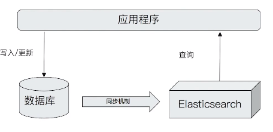

# 第四课 ES家族成员及其应用场景

# 一、Logstash特性

- 实时解析和转换数据
  - 从IP地址破译出地理坐标
  - 将PII数据匿名化，完全排除敏感字段
- 可扩展
  - 200多个插件（日志 / 数据库 / Arcsigh / Netflow）
- 可靠性安全性
  - Logstash会通过持久化队列来保证至少将运行中的事件送达一次
  - 数据传输加密
- 监控

# 二、日志管理

日志搜集 -》 格式化分析 -》 全文检索 -》 风险告警

# 三、ES与数据库的集成

- 单独使用ES存储
- 以下情况可考虑与数据库集成
  - 与现有系统的集成
  - 需考虑事务性
  - 数据更新频繁