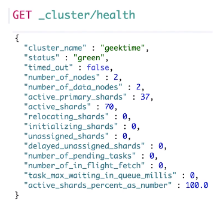

# 第十课 基本概念：节点、集群、分片及副本

# 一、分布式系统的可用性与扩展性

- 高可用性
  - 服务可用性：允许有节点停止服务
  - 数据可用性：部分节点丢失，不会丢失数据
- 可扩展性
  - 请求量提升 / 数据的不断增长（将数据分布到所有接点上）
  
# 二、分布式特性

- ES的分布式架构的好处
  - 存储的水平扩容
  - 提高系统的可用性，部分节点停止服务，整个集群的服务不受影响
- ES的分布式架构
  - 不同的集群通过不同的名字来区分，默认名字“elasticsearch”
  - 通过配置文件修改，或者在命令行中添加”-E cluster.name=geektime“进行设定
  - 一个集群可以有一个或多个节点

# 三、节点

- 节点是一个ES的实例
  - 本质上就是一个JAVA进程
  - 一台机器上可以运行多个ES进程，但是生产环境一般建议一台机器上只运行一个ES实例
- 每一个节点都有名字，通过配置文件配置，或者启动时候“-E node.name=node1”指定
- 每一个节点在启动之后，会分配一个UID，保存在data目录下

# 四、Master-eligible nodes和Master Node

- 每个节点启动后，默认就是一个Master eligible节点
  - 可以设置node.master: false禁止
- Master-eligible节点可以参加选主流程，成为Master节点
- 当第一个节点启动的时候，它会将自己选举成Master接点
- 每个节点上都保存了集群的状态，只有Master节点才能修改集群的状态信息
  - 集群状态（Cluster State），维护了一个集群中，必要的信息
    - 所有的节点信息
    - 所有的索引和其相关的Mapping与Setting信息
    - 分片的路由信息
  - 任意节点都能修改会导致数据的不一致性

# 五、Data Node & Coordinating Node

- Data Node
  - 可以保存数据的节点，叫做Data Node。负责保存分片数据。在数据扩展上起到了至关重要的作用
- Coordinating Node
  - 负责接受Client的请求，将请求分发到合适的节点，最终把结果汇集到一起
  - 每个节点默认都起到了Coordinating Node的职责

# 六、其他节点类型

- Hot & Warm Node
  - 不同硬件配置的Data Node，用来实现Hot & Warm架构，降低集群的部署成本
- Machine Learning Node
  - 负责跑机器学习的Job，用来做异常检测
- Tribe Node
  - （5.3开始使用Cross Cluster Search）Tribe Node连接到不同的ES集群，并且支持将这些集群当成一个单独的集群处理

# 七、配置节点类型

- 开发环境中：一个节点可以承担多个角色
- 生产环境中：应该设置单一的角色的节点（dedcated node）

|节点类型|配置参数|默认值|
|-|-|-|
|master eligible|node.master|true|
|data|node.data|true|
|ingest|node.ingest|true|
|coordinating only|无|每个节点默认都是coordinating node。设置其他类型全部为false|
|machine learning|node.ml|true（需enable X-Pack）|

# 八、分片

- 主分片，用以解决数据水平扩展的问题。通过主分片，可以将数据分布到集群内的所有节点之上
  - 一个分片是一个运行的Lucene的实例
  - 主分片数在索引创建时指定，后续不允许修改，除非Reindex
- 副本，用以解决数据高可用的问题。分片时主分片的拷贝。
  - 副本分片数，可以动态的调整
  - 增加副本数，还可以在一定程度上提高服务的可用性（读取的吞吐）

# 九、分片的设定

- 对于生产环境中分片的设定，需要提前做好容量规划
  - 分片数设置过小
    - 导致后续无法增加节点实现水平扩展
    - 单个分片的数量太大，导致数据重新分配耗时
  - 分片数设置过大，7.0开始，默认主分片设置成1，解决了over-sharding的问题
    - 影响搜索结果的相关性打分，影响统计结果的准确性
    - 单个节点上过多的分片，会导致资源浪费，同时也会影响性能
  
# 十、查看集群的健康状况

- Green：主分片与副本都正常分配
- Yellow：主分片全部正常分配，有副本分片未能正常分配
- Red：有主分片未能正常分配
  - 例如，当服务器的磁盘容量超过85%时，去创建了一个新的索引

# 十一、Demo

- 查看一个集群的健康状况 http://localhost:9200/_cluster/health
- CAT API
  - http://localhost:9200/_cat/nodes
  - 查看索引和分片
- 设置分片数
- Kibana + Cerebro界面介绍