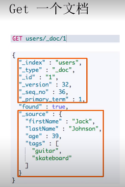
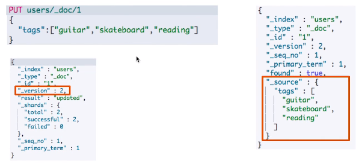
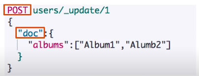
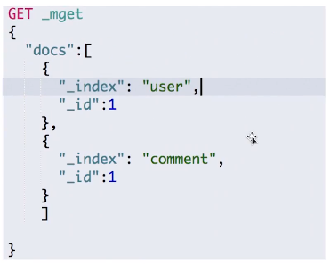
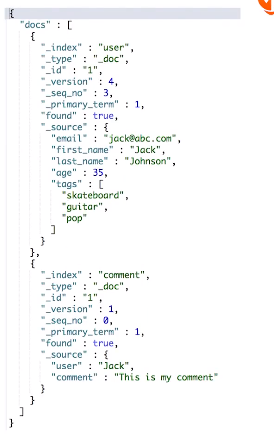
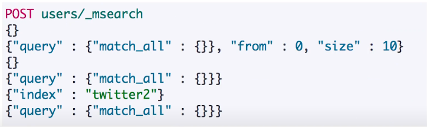

# 第十一课 文档的基本CRUD与批量操作

# 一、文档的CRUD

- Type名：约定都用`_doc`
- Create：如果ID已经存在，会失败
- Index：如果ID不存在，创建新的文档。否则，先删除现有的文档，在创建新的文档，版本会增加。
- Update：文档必须已经存在，更新只会对相应字段做增量修改

|||
|-|-|
|Index|**PUT** my_index/_doc/1 {"user": "mike", "comment": "You know"}|
|Create|**PUT** my_index/_create/1 {"user": "mike", "comment": "You know"} <br> **POST** my_index/_doc(不指定ID，会自动生成) {"user": "mike", "comment": "You know"}|
|Read|**GET** my_index/_doc/1|
|Update|**POST** my_index/_update/1 {"doc": {"user": "mike", "comment": "es"}}|
|Delete|**DELETE** my_index/_doc/1|

# 二、Create一个文档

- 支持自动生成文档ID和指定文档ID两种方式
- 通过调用"POST /users/_doc"
    - 系统会自动生成document_id
- 使用HTTP PUT user/_create/1创建时，URI中显示指定_create，此时如果该id的文档已经存在，操作失败，报错

# 三、Get一个文档



- 找到文档，返回 HTTP 200
    - 文档元信息
        - _index/_type/
        - 版本信息，同一个ID的文档，即使被删除，Version号也会不断增加
        - _source中默认包含了文档的所有原始信息
- 找不到文档，返回 HTTP 404

# 四、Index文档



- Index和Create不一样的地方：如果文档不存在，就索引新的文档。否则现有的文档会被删除，新的文档被索引。版本信息+1

# 五、Update文档



- Update方法不会删除原来的文档，而是实现真正的数据更新
- Post方法 /Payload 需要包含在“doc”中

# 六、Bulk API


- 支持在一次API调用中，对不同的索引进行操作
- 支持四种操作类型
    - Index
    - Create
    - Update
    - Delete
- 可以在URI中指定Index，也可以在请求的payload中进行
- 操作中单条操作失败，会报错，但并不会影响其他操作
- 返回结果包括了每一条操作执行的结果

# 七、批量读取 - mget





批量操作，可以减少网络连接所产生的开销，提高性能

# 八、批量查询 - msearch



```sh
POST users/_msearch
```

# 九、常见错误返回

|问题|原因|
|-|-|
|无法连接|网络故障或集群挂了|
|连接无法关闭|网络故障或节点出错|
|429|集群过于繁忙|
|4XX|请求体格式有错|
|500|集群内部错误|