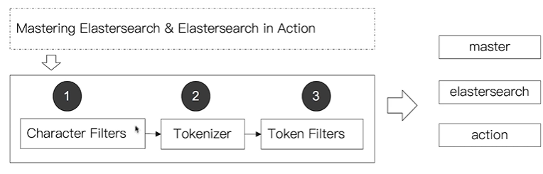
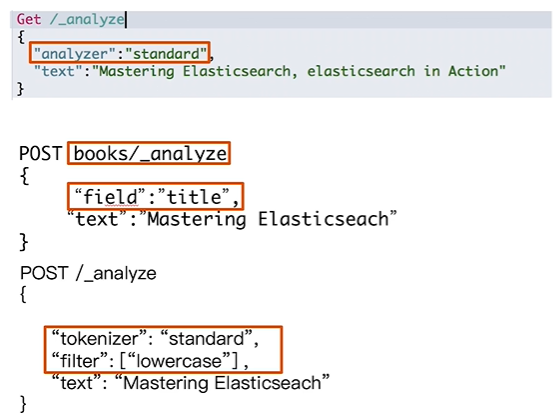
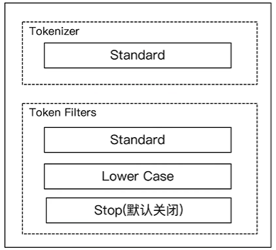
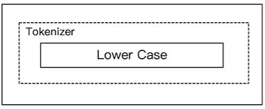
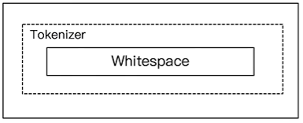
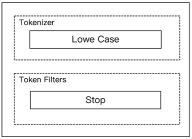
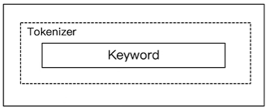
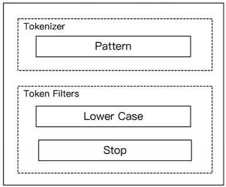

# 第十三课 通过Analyzer进行分词

# 一、Analysis 与 Analyzer

- Analysis：文本分析是把全文本转换到一系列单词（term / token）的过程，也叫**分词**
- Analysis是通过`Analyzer(分词器)`来实现的
  - 可使用ES内置的分析器，或者按需定制化分析器
- 除了在数据写入时转换词条，匹配Query语句时候也需要用相同的分析器对查询语句进行分析

# 二、Analyzer的组成

- 分词器是专门处理分词的组件，Analyzer由三部分组成
  - Character Filters（针对原始文本处理，例如去除html） / Tokenizer（按照规则切分为单词） / Token Filter（将切分的单词进行加工，小写，删除stopwords，增加同义词）



# 三、ES的内置分词器

- Standard Analyzer - 默认分词器，按词切分，小写处理
- Simple Analyzer - 按照非字母切分（符号被过滤），小写处理
- Stop Analyzer - 小写处理，停用词过滤（the, a, is）
- Whitespace Analyzer - 按照空格切分，不转小写
- Keyword Analyzer - 不分词，直接将输入当做输出
- Pattern Analyzer - 正则表达式，默认 \W+ (非字符分割)
- Language - 提供了30多种常见语言的分词器
- Customer Analyzer - 自定义分词器

# 四、使用_analyzer API

- 直接指定Analyzer进行测试
- 指定索引的字段进行测试
- 自定义分词器进行测试



# 五、Standard Analyzer

- 默认分词器
- 按词切分
- 小写处理



```sh
#standard
GET _analyze
{
  "analyzer": "standard",
  "text": "2 running Quick brown-foxes leap over lazy dogs in the summer evening."
}
```

# 六、Simple Analyzer

- 按照非字母切分，非字母的都被去除
- 小写处理



```sh
#simpe
GET _analyze
{
  "analyzer": "simple",
  "text": "2 running Quick brown-foxes leap over lazy dogs in the summer evening."
}
```

# 七、Whitespace Analyzer

- 按照空格切分



```sh
# whitespace
GET _analyze
{
  "analyzer": "whitespace",
  "text": "2 running Quick brown-foxes leap over lazy dogs in the summer evening."
}
```

# 八、Stop Analyzer

- 相比Simple Analyzer
  - 多了stop filter
    - 会把`the`, `a`, `is`等修饰性词语去除



```sh
# stop
GET _analyze
{
  "analyzer": "stop",
  "text": "2 running Quick brown-foxes leap over lazy dogs in the summer evening."
}
```

# 九、Keyword Analyzer

- 不分词，直接将输入当一个term输出



```sh
#keyword
GET _analyze
{
  "analyzer": "keyword",
  "text": "2 running Quick brown-foxes leap over lazy dogs in the summer evening."
}
```

# 十、Pattern Analyzer

- 通过正则表达式进行分词
- 默认是`\W+`，非字符的符号进行分割



```sh
# pattern
GET _analyze
{
  "analyzer": "pattern",
  "text": "2 running Quick brown-foxes leap over lazy dogs in the summer evening."
}
```

# 十一、Language Analyzer

```sh
#english
GET _analyze
{
  "analyzer": "english",
  "text": "2 running Quick brown-foxes leap over lazy dogs in the summer evening."
}
```

# 十二、中文分词的难点

- 中文句子，切分成一个一个词（不是一个一个字）
- 英文中，单词有自然的空格作为分隔
- 一句中文，在不同的上下文，有不同的理解
  - 这个苹果，不大好吃 / 这个苹果，不大，好吃！
- 一些例子
  - 他说的确实在理 / 这事的确定不下来

# 十三、ICU Analyzer

- 需要安装plugin
  - Elasticsearch-plugin install analysis-icu
- 提供了Unicode的支持，更好的支持亚洲语言

# 十四、更多的中文分词器

- IK
  - 支持自定义词库，支持热更新分词字典
  - https://github.com/medcl/elasticsearch-analysis-ik
- THULAC
  - THU Lexucal Analyzer for Chinese, 清华大学自然语言处理和社会人文计算实验室的一套中文分词器
  - https://github.com/microbun/elascticsearch-thulac-plugin
