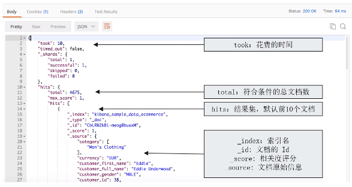

# 第十四课 Search API概览

# 一、Search API

- URI Search
  - 在URL中使用查询参数
- Request Body Search
  - 使用ES提供的，基于JSON格式的更加完备的Query Domain Specific Language（DSL）

# 二、指定查询的索引

|语法|范围|
|-|-|
|/_search|集群上所有的索引|
|/index1/_search|index1|
|/index1,index2/_search|index1和index2|
|/index*/_search|以index开头的索引|

# 三、URI查询

- 使用“q”，指定查询字符串
- “query string syntex”，KV键值对

# 四、Request Body

# 五、搜索Response

# 六、搜索的相关性Relevance

- 搜索是用户和搜索引擎的对话
- 用户关心的是搜索结果的相关性
  - 是否可以找到所有相关的内容
  - 有多少不相关的内容被返回了
  - 文档的打分是否合理
  - 结合业务需求，平衡结果排名

# 七、衡量相关性

- Information Retrieval
  - Precision（查准率）：尽可能返回较少的无关文档
  - Recall（查全率）：尽量返回较多的相关文档
  - Ranking：是否能够按照相关度进行排序

