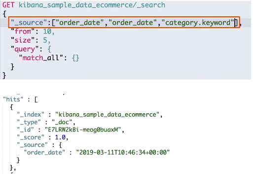

# 第十六课 Request Body与Query DSL简介

# 一、Request Body Search

- 将查询语句通过HTTP Request Body发送给ES
- Query DSL


# 二、分页


- From从0开始，默认返回10个结果
- 获取靠后的翻页成本较高

# 三、排序


- 最好在“数字型”与日期型字段上排序
- 因为对于多值类型或分析过的字段排序，系统会选一个值，无法得知该值

```sh
#对日期排序
POST kibana_sample_data_ecommerce/_search
{
  "sort":[{"order_date":"desc"}],
  "query":{
    "match_all": {}
  }
}
```

# 四、_source filtering



- 如果_source没有存储，那就只返回匹配的文档的元数据
- _source支持使用通配符。_source["name*", "desc*"]

```sh
#source filtering
POST kibana_sample_data_ecommerce/_search
{
  "_source":["order_date"],
  "query":{
    "match_all": {}
  }
}
```

# 五、脚本字段


- 用例：订单中有不同的汇率，需要结合汇率，对订单价格进行排序

```sh
#脚本字段
GET kibana_sample_data_ecommerce/_search
{
  "script_fields": {
    "new_field": {
      "script": {
        "lang": "painless",
        "source": "doc['order_date'].value+'hello'"
      }
    }
  },
  "query": {
    "match_all": {}
  }
}
```

# 六、使用查询表达式 - Match

```sh
POST movies/_search
{
  "query": {
    "match": {
      "title": "last christmas" # 默认是OR
    }
  }
}

POST movies/_search
{
  "query": {
    "match": {
      "title": {
        "query": "last christmas",
        "operator": "and"
      }
    }
  }
}
```

# 七、短语搜索 - Match Phrase

```sh
POST movies/_search
{
  "query": {
    "match_phrase": {
      "title":{
        "query": "one love" # 必须按顺序出现，默认OR
      }
    }
  }
}

POST movies/_search
{
  "query": {
    "match_phrase": {
      "title":{
        "query": "one love",
        "operator": "and" # 使用AND
      }
    }
  }
}

POST movies/_search
{
  "query": {
    "match_phrase": {
      "title":{
        "query": "one love",
        "slop": 1 # 设置slop：1可以允许单词间有1个别的词
      }
    }
  }
}
```