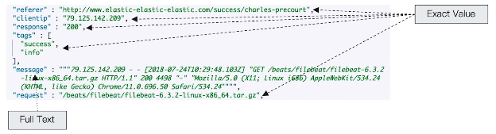
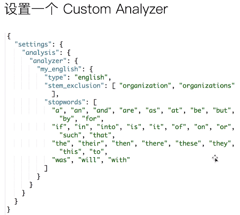

# 第二十课 多字段特性及Mapping中配置自定义Analyzer

# 多字段类型

- 多字段特性
  - 厂商名字实现精确匹配
    - 增加一个keyword字段
  - 使用不同的analyzer
    - 不同语言
    - pinyin字段的搜索
    - 还支持为搜索和索引指定不同的analyzer

# Exact Values(精确值) v.s Full Text(全文本)

- Excat values v.s Full Text
  - Excat Values: 包括数字、日期、具体一个字符串（例如“Apple Store”）
    - ES中的keyword
  - 全文本，非结构化的文本数据
    - ES中的text

# Excat Values不需要被分词

- ES为每一个字段创建了一个倒排索引
  - Excat Value在索引时，不需要做特殊的分词处理

# 自定义分词

- 当ES自带的分词器无法满足时，可以自定义分词器。通过自组合不同的组件实现。
  - Character Filter
  - Tokenizer
  - Token Filter

# Character Filters

- 在Tokenizer之前对文本进行处理，例如增加删除及替换字符。可以配置多个Character Filters。会影响Tokenizer的position和offset信息
- 一些自带的Character Filters
  - HTML strip — 去除html标签
  - Mapping - 字符串替换
  - Pattern replace - 正则匹配替换

# Tokenizer

- 将原始的文本按照一定的规则，切分为词（term or token）
- ES内置的Tokenizer
  - whitespace / standard / uax_url_email / pattern / keyword / path hierarchy
- 可以用Java开发插件，实现自己的Tokenizer

# Token Filters

- 将Tokenizer输出的单词（term），进行增加，修改，删除
- 自带的Token Filters
  - Lowercase / stop / synonym(添加近义词)

# 设置自定义Analyzer

