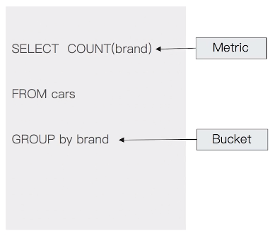

# 第二十二课 Elasticsearch聚合分析简介

# 什么是聚合（Aggregation）

- ES除搜索以外，提供的针对ES数据进行统计分析的功能
  - 实时性高
  - Hadoop（T+1）
- 通过聚合，我们会得到一个数据的概览，是分析和总结全套的数据，而不是寻找单个文档
  - 尖沙咀和香港岛的客房数量
  - 不同的价格区间，可预订的经济型酒店和五星级酒店的数量
- 高性能，只需要一条语句，就可以从ES得到分析结果
  - 无需在客户端自己去实现分析逻辑

# 聚合的分类

- Bucket Aggregation - 一些满足特定条件的文档的集合
- Metric Aggregation - 一些数学运算，可以对文档字段进行统计分析
- Pipeline Aggregation - 对其他的聚合结果进行二次聚合
- Matrix Aggregation - 支持对多个字段的操作并提供一个结果矩阵

# Bucket & Metric



- Metric - 一系列的统计方法
- Bucket - 一组满足条件的文档

# Bucket

- 一些例子
  - 杭州属于浙江 / 一个演员属于男或女
  - 嵌套关系 - 杭州属于浙江属于中国属于亚洲
- ES提供了很多类型的Bucket，帮助你用多种方式划分文档
  - Term & Range（时间 / 年龄区间 / 地理位置）

# Metric

- Metric会基于数据集计算结果，除了支持在字段上进行计算，同样也支持在脚本（painless script）产生的结果之上进行计算
- 大多数Metric是数学计算，仅输出一个值
  - min / max / sum / avg / cardinality
- 部分metric支持输出多个数值
  - stats（统计数值，八最高、最低、平均值） / percentiles（百分位） / percentile_ranks

# 一个Bucket例子
```sh
#按照目的地进行分桶统计
GET kibana_sample_data_flights/_search
{
	"size": 0,
	"aggs":{
		"flight_dest":{
			"terms":{
				"field":"DestCountry"
			}
		}
	}
}
```


# 加入Metrics

```sh
#查看航班目的地的统计信息，增加平均，最高最低价格
GET kibana_sample_data_flights/_search
{
	"size": 0,
	"aggs":{
		"flight_dest":{
			"terms":{
				"field":"DestCountry"
			},
			"aggs":{
				"avg_price":{
					"avg":{
						"field":"AvgTicketPrice"
					}
				},
				"max_price":{
					"max":{
						"field":"AvgTicketPrice"
					}
				},
				"min_price":{
					"min":{
						"field":"AvgTicketPrice"
					}
				}
			}
		}
	}
}
```


# 嵌套

```sh
#价格统计信息+天气信息
GET kibana_sample_data_flights/_search
{
	"size": 0,
	"aggs":{
		"flight_dest":{
			"terms":{
				"field":"DestCountry"
			},
			"aggs":{
				"stats_price":{
					"stats":{
						"field":"AvgTicketPrice"
					}
				},
				"wather":{
				  "terms": {
				    "field": "DestWeather",
				    "size": 5
				  }
				}

			}
		}
	}
}
```
