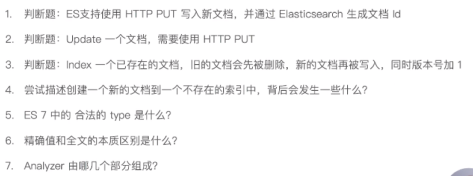

# 第二十三课 第一部分总结

# 第一部分总结与回顾：产品与使用场景

- ES是一个开源的分布式搜索与分析引擎，提供了近实时搜索和聚合两大功能
- Elastic Stack包括ES，Kibana，Logstash，Beats等一系列产品。ES是核心引擎，提供了海量数据存储，搜索和聚合的能力。Beats是轻量的数据采集器，Logstash用来做数据转换，Kibana则提供了丰富的可视化展现与分析的功能。
- Elastic Stack主要被广泛用于：搜索，日志管理，安全分析，指标分析，业务分析，应用性能监控等多个领域。
- Elastic Stack开源了X-Pack在内的相关代码。作为商业解决方案，X-Pack的部分功能需要收费。Elastic公司从6.8和7.1开始，Security功能也可以免费使用。
- 相比关系型数据库，ES提供了如模糊查询，搜索条件的算分第等关系型数据库所不擅长的功能，但是在事务性等方面，也不如关系型数据库来的强大。因此，在实际生产环境中，需要考虑具体业务需求，综合使用。

# 第一部分总结与回顾：基本概念

- 一个ES集群可以运行在单个节点上，也支持运行在多个服务器上，实现数据和服务的水平扩展
- 从逻辑角度看，索引是一些具有相似结构的文档的集合
- 物理角度看，分片是一个Lucene的实例。分片存储了索引的具体数据，分片可以分布在不同的节点之上。副本分片除了提供数据的可靠性，还能一定程度提升集群查询的性能。
- ES的文档可以是任意的JSON格式的数据
- 将文档写进ES的过程叫索引（indexing）
- ES提供了REST API和Transport API两种方式，建议使用REST API。

# 第一部分总结与回顾：搜索和Aggravation

- Precosion指除了相关的结果，还返回了多少不相关的结果
- Recall - 衡量有多少相关的结果，实际上并没有返回
- 精确值包括：数字、日期和某些具体的字符串
- 全文本：是需要被检索的非结构文本
- Analysis是将文本转换成倒排索引中的Terms的过程
- ES的Analyzer是Char_filter -> Tokenizer -> Token Filter的过程
- 要善于利用_analyze API去测试Analyzer
- ES搜索支持URI Search和REST Body两种方式
- ES提供了Bucket / Metric / Pipeline / Matrix四种方式的聚合

# 第一部分总结与回顾：文档CRUD与Index Mapping

- 除了CRUD操作外，ES还提供了bulk，meget和msearch等操作。从性能的角度上说，建议使用，以提升性能。但是，单次操作的数据量不要过大，以免引发性能问题
- 每个索引都有一个Mapping定义。包含文档的字段及类型，字段的Analyzer的相关配置
- Mapping可以被动态的创建，为了避免一些错误的类型推算或者满足你特定的需求，可以显示的定义Mapping
- Mapping可以动态创建，也可以显示定义。你可以在Mapping中定制Analyzer
- 你可以为字段指定定制化的analyzer，也可以为查询字符串指定search_analyzer
- Index Template可以定义Mapping和Settings，并自动的应用到新创建的索引之上，建议要合理的使用Index Template
- Dynamic Template支持在具体的索引上指定规则，为新增加的字段指定相应的Mappings

# 测验

