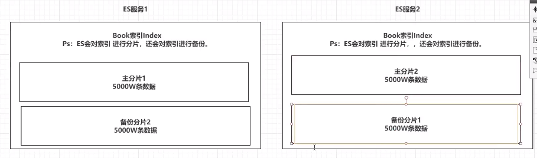
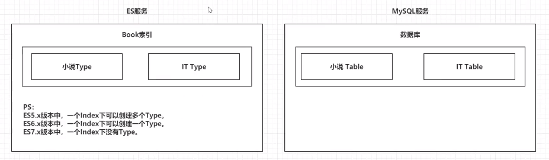
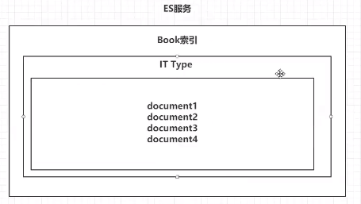
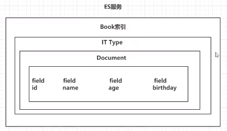

# ES的结构

## 1 索引 Index

ES的服务中，可以创建多个索引。

每一个索引默认被分成5片存储。

每一个分片都会存在至少一个备份分片。

备份分片默认不会帮助检索数据，当ES检索压力特别大的时候，备份分片才会帮助检索数据。

## 2 类型 Type

一个索引下，可以创建多个类型。

Ps:根据版本不同，类型的创建也不同。

## 3 文档 Document

一个类型下，可以有多个文档。这个文档就类似于MySQL表中的多行数据。

## 4 属性 Field

一个文档中，可以包含多个属性。类似于MySQL表中的一行数据存在多个列。

